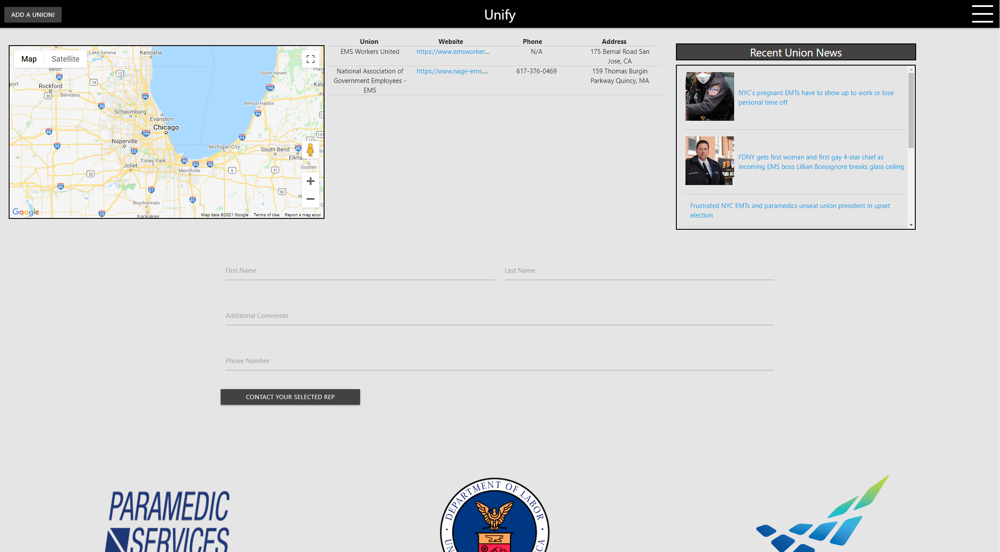

###API Keys are not included with deployed version for security purposes.

## Live Deploy
https://vygoth.github.io/Unify/

# Unify

# Contact
Vygoth
JeremyJoanet@Protonmail.com

## Description
Plenty of pushes, plenty of updates.

We all came together to design and implement the intial HTML layout.

Jeremy focused primarily on implementing the Modal form and the JS code for the Api's (serp/maps/geolocation).

Matt focused primarily on the mail to form and other JS implementation.

Zachs primary focus was on css, styling, design and overall appearance.

Teamwork makes the dreamwork.

The point of our site is to help bridge the gap between workers and unions, by allowing workers to find and reach out to unions on a universal platform.

## Table of Contents
- [Usage](#Usage)
- [Credits](#Credits)
- [Screenshot](#Screenshot)

## Usage
This application has a live deploy link located at the top of this README

## Credits
Zach Duty, Matt Reisdorf

## Screenshot

